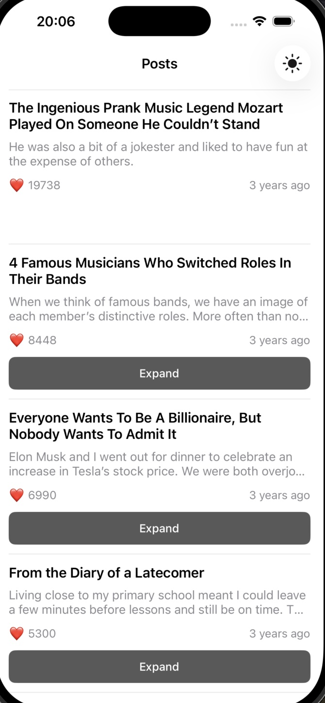
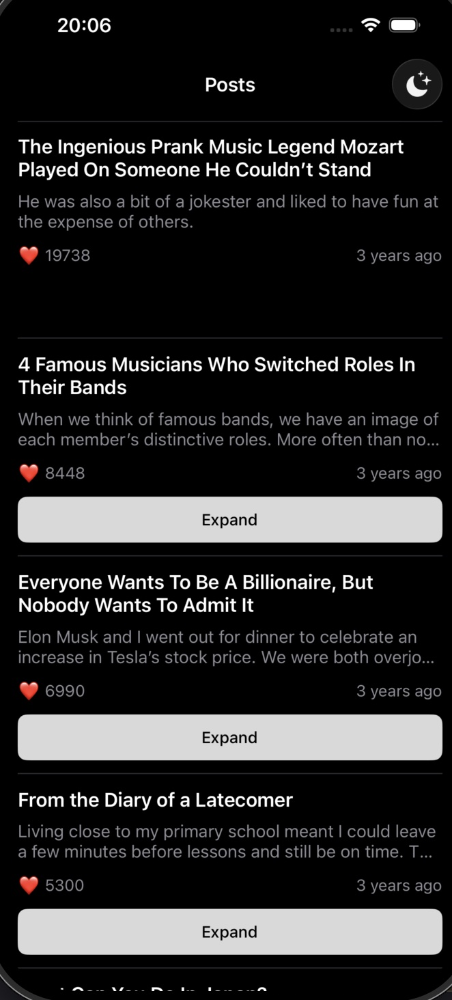

# YourPostsApp

A beginner-friendly iOS app that fetches and displays posts from a remote API. Built with **UIKit** and **MVVM architecture** to demonstrate modern iOS development patterns.

## Screenshots

| Feed (Light) | Feed (Dark) | Detail (Light) | Detail (Dark) |
|:---:|:---:|:---:|:---:|
|  |  |  |  |

## Features

- **Post Feed** - Browse a list of posts with titles, previews, likes, and relative timestamps
- **Expandable Previews** - Tap "Expand" to see full preview text (button hides if text fits)
- **Post Details** - View full post content with image, title, and formatted date
- **Dark Mode** - Toggle between light and dark themes with the sun/moon button
- **Pull to Refresh** - Swipe down to reload posts
- **Error Handling** - User-friendly error messages for network issues

## Architecture

This app follows the **MVVM (Model-View-ViewModel)** pattern:

```
YourPostsApp/
├── Models/          # Data structures (Post, PostDetail)
├── Views/           # UI components (ViewControllers, Cells)
├── ViewModels/      # Business logic (FeedViewModel, PostDetailViewModel)
├── Services/        # API communication (NetworkService)
└── Resources/       # Assets and configurations
```

### How Data Flows

```
User Action → ViewController → ViewModel → NetworkService → API
                    ↑              ↓
                    └──── Update UI ←────┘
```

1. **User** taps on the app
2. **ViewController** asks ViewModel for data
3. **ViewModel** calls NetworkService
4. **NetworkService** fetches from API
5. Data flows back and UI updates

## Technologies Used

| Technology | Purpose |
|------------|---------|
| UIKit | User interface framework |
| UICollectionView | Display post list with DiffableDataSource |
| async/await | Modern Swift concurrency for networking |
| URLSession | Native HTTP networking |
| Codable | JSON parsing |
| Auto Layout | Programmatic UI constraints |

## Getting Started

### Requirements

- Xcode 15.0+
- iOS 17.0+
- Swift 5.9+

### Installation

1. **Clone the repository**
   ```bash
   git clone https://github.com/kurog1ri/YourPostsApp.git
   ```

2. **Open in Xcode**
   ```bash
   cd YourPostsApp
   open YourPostsApp.xcodeproj
   ```

3. **Run the app**
   - Select a simulator (iPhone 15 recommended)
   - Press `Cmd + R` or click the Play button

## Project Structure Explained

### Models (`Models/Post.swift`)

Defines the data structures:

```swift
struct Post: Codable, Hashable, Sendable {
    let postId: Int
    let timeshamp: Int      // Unix timestamp
    let title: String
    let previewText: String
    let likesCount: Int
}
```

### ViewModels

**FeedViewModel** - Manages the post list:
- Fetches posts from API
- Tracks which posts are expanded
- Formats dates to "5 minutes ago" style

**PostDetailViewModel** - Manages single post details:
- Fetches full post content
- Formats date to "31 January 2026" style

### Views

**FeedViewController** - Main screen showing all posts:
- Uses `UICollectionView` with modern DiffableDataSource
- Handles cell configuration and tap events
- Contains dark mode toggle button

**PostCell** - Individual post in the list:
- Shows title, preview, likes, and date
- Smart expand button (hides if text fits)

**PostDetailViewController** - Full post view:
- Scrollable content with image
- Back navigation

### Services (`Services/NetworkService.swift`)

Handles all API communication:

```swift
// Fetches all posts
func fetchPosts() async throws -> [Post]

// Fetches single post details
func fetchPostDetail(id: Int) async throws -> PostDetail
```

## API Reference

The app uses a simple REST API:

| Endpoint | Description |
|----------|-------------|
| `GET /main.json` | Returns list of all posts |
| `GET /posts/{id}.json` | Returns details for a specific post |

Base URL: `https://raw.githubusercontent.com/anton-natife/jsons/master/api`

## Key Concepts for Beginners

### What is MVVM?

- **Model** - Your data (Post, PostDetail)
- **View** - What users see (ViewControllers, Cells)
- **ViewModel** - The brain that connects Model and View

Benefits: Easier testing, cleaner code, separation of concerns.

### What is DiffableDataSource?

A modern way to manage UICollectionView/UITableView data that:
- Automatically animates changes
- Prevents crashes from data mismatches
- Uses unique identifiers for items

### What is async/await?

Swift's modern way to handle asynchronous code (like network requests):

```swift
// Old way (completion handlers)
fetchPosts { result in
    // handle result
}

// New way (async/await)
let posts = try await fetchPosts()
```

## Troubleshooting

**App shows loading forever?**
- Check your internet connection
- The API might be temporarily unavailable

**Build errors?**
- Make sure you're using Xcode 15+ and iOS 17+ target
- Try `Product → Clean Build Folder` (Cmd + Shift + K)

**Dark mode not working?**
- Tap the sun/moon icon in the navigation bar
- Check that your simulator supports appearance changes

## License

This project is available for learning purposes. Feel free to use it as a reference for your own iOS projects.

---

Built with UIKit and Swift
